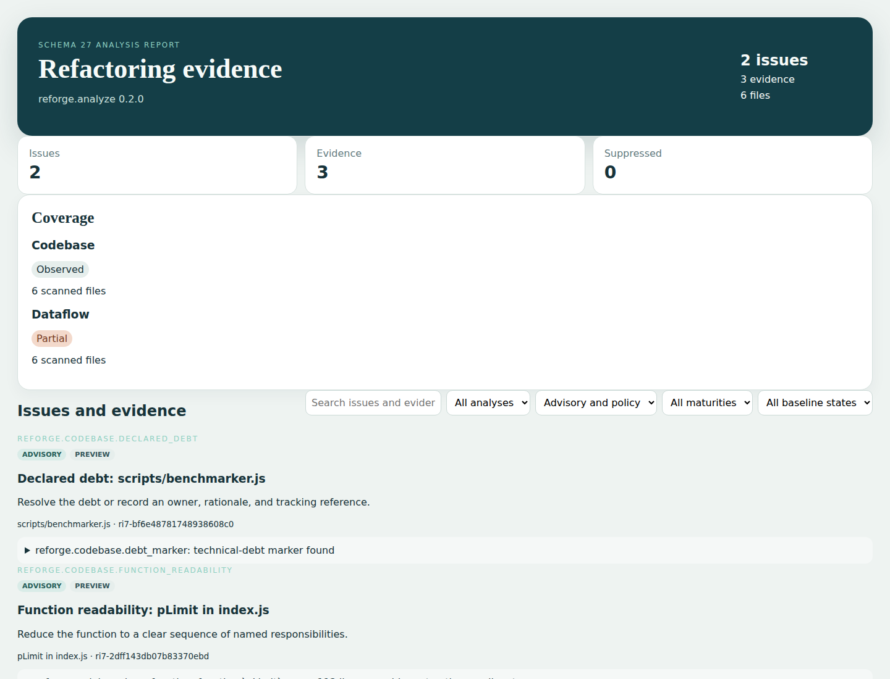

<p align="center">
  
</p>

<p align="center">
  <a href="https://github.com/LyleMi/Reforge/actions/workflows/ci.yml"></a>
  <a href="https://github.com/LyleMi/Reforge/releases/latest"></a>
  <a href="LICENSE"></a>
  <a href="https://lylemi.github.io/Reforge/"></a>
</p>

# Auditable refactoring guardrails for agent-written code

Reforge gives maintainers and coding agents a reviewable gate for structural risk:

- Detect agent drift such as duplicated implementations, generic buckets, dependency tangles, and over-relayed values.
- Attach concrete Evidence—measurements, locations, and exact source-to-sink witnesses—to every Issue.
- Disclose partial Coverage and suppressions, so “no Issues” never implies more analysis than actually ran.

## Install and run in 30 seconds

Unix (Linux x86_64 or macOS Intel/Apple Silicon):

```sh
curl -fsSL https://raw.githubusercontent.com/LyleMi/Reforge/main/scripts/install.sh | sh
reforge analyze .
```

PowerShell (Windows x86_64):

```powershell
& ([scriptblock]::Create((irm https://raw.githubusercontent.com/LyleMi/Reforge/main/scripts/install.ps1)))
reforge analyze .
```

Pin a release with `--version v0.2.0` / `-Version v0.2.0`. Installers verify SHA-256 and the binary version, then install `reforge` and the `reforge-analyze` Codex skill. They never edit your shell profile.

## A real calibration result

This compact excerpt comes from the frozen `sindresorhus/p-limit@df476048d023ff868cd45b35ee47f5fb0ca2b25a` calibration input. It is reproducible with the committed corpus and configuration:

```text
reforge.analyze 0.2.0 report (schema 27)
Issues: 2  Evidence: 3  Suppressed: 0

ri7-2dff143db07b83370ebd  Function readability: pLimit in index.js
  - reforge.codebase.long_function: function `pLimit` spans 113 lines
  - reforge.codebase.complex_function: estimated complexity 19

Coverage:
  codebase: Observed (6)
  dataflow: Partial (6)
    unresolved_flow_edge (43): flow edges could not be resolved exactly
```

<p align="center">
  <a href="https://lylemi.github.io/Reforge/sample/"></a>
</p>

Open the [live Reforge self-analysis](https://lylemi.github.io/Reforge/sample/) or create a fully offline report:

```sh
reforge analyze . --output html --output-file reforge-report.html --reproducible
```

The committed preview can be regenerated with `scripts/generate-report-preview.sh`; the full third-party HTML/JSON report is intentionally not committed.

## Why Reforge

| Approach | What it answers | What the gate receives |
| --- | --- | --- |
| Lint | Does code violate a local syntax or style rule? | A diagnostic at a location |
| Single health score | Did an aggregate number move? | A number whose coverage and causes may be unclear |
| Reforge | What refactoring risk was observed, why, and where was analysis incomplete? | Typed Issues, nested Evidence, ordered witnesses, Coverage receipts, and baseline state |

Reforge runs locally, does not upload source code, and includes no telemetry. Its findings are refactoring evidence—not severity, priority, a health score, or defect probability.

## Analysis support

Codebase supports Rust, JavaScript, TypeScript/TSX, Vue SFC script blocks, Python, Go, Java, C#, Kotlin, PHP, Ruby, Bash, and PowerShell. Dependency-graph rules also recognize C and C++.

Dataflow builds conservative value paths for Rust, JavaScript, TypeScript/TSX, and Python. It reports a witness only when the complete path is exact; partial, unresolved, and unsupported observations remain visible in Coverage.

Codebase runs by default. Select Dataflow alone or combine both analyses over one workspace index:

```sh
reforge analyze . --analysis dataflow --output json --reproducible
reforge analyze . --analysis codebase --analysis dataflow --reproducible
```

## CI baselines and agent use

Version policy in `reforge.toml`, enforce selected rules, and gate only new or changed policy Issues against a reviewed schema 27 baseline:

```sh
reforge analyze . --output json --output-file current.json \
  --baseline reforge-baseline.json --gate new --reproducible
```

The default installation also provides the `reforge-analyze` skill. An agent using it must read Issues as decision units, inspect nested Evidence and ordered witnesses, and disclose every selected analysis's Coverage before interpreting an empty result.

## Documentation

- [User guide](docs/user-guide.md) and [configuration reference](docs/configuration.md)
- [Codebase and Dataflow analyses](docs/analyses.md) and [Dataflow contract](docs/dataflow.md)
- [Schema 27 report contract](docs/report-schema.md) and [HTML report](docs/report-app.md)
- [Upgrade from 0.1 to 0.2](docs/upgrading-to-0.2.md)
- [Architecture](docs/architecture.md), [calibration protocol](docs/calibration-samples.md), and [release process](docs/release.md)

The core product is `reforge analyze`. `reforge-unity` is an experimental specialization, and `reforge-workflow` is an optional approval-gated report consumer; neither changes the core Codebase/Dataflow model.

## Development

```sh
cargo fmt --all -- --check
cargo clippy --locked --workspace --all-targets --all-features -- -D warnings
cargo test --locked --workspace --all-targets --all-features
```
